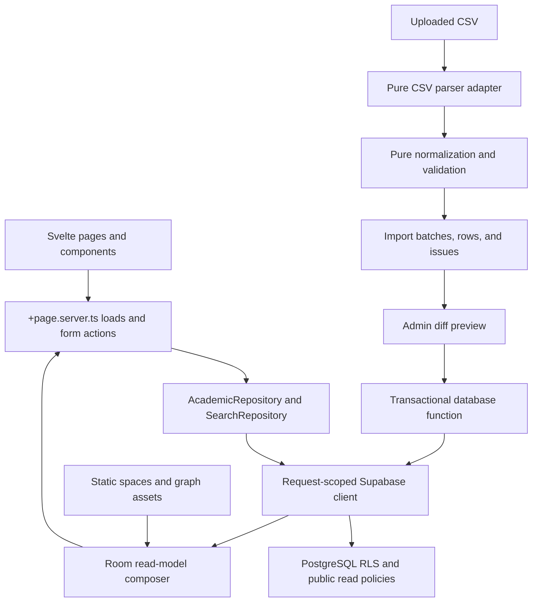

# Milestone 2A — Academic Core Implementation Blueprint

Date: 2026-08-13
Scope: Steps 5–12, with architectural constraints for Steps 13–17
Status: Planning artifact; no application or database implementation is included

## Outcome

Build the academic experience as a set of typed, server-loaded read models over the local Supabase database, then add a fail-closed CSV staging workflow. Public pages must expose only `published` records. Development uses visibly synthetic seed records; an empty production database produces deliberate “no published data” states instead of demo content.

The implementation should proceed as 6 reviewable vertical slices:

1. Integration and security gate
2. Repository contracts and public read models
3. Courses, faculty, consultations, and room pages
4. Universal Search V2
5. CSV parse and validation pipeline
6. Admin import preview and transactional apply

## Starting-Point Assessment

### What is ready

- The spatial and grade engines already have isolated domain logic under `src/lib/domain/`.
- Permanent space IDs such as `mb304` connect static geometry to PostgreSQL foreign keys.
- Migrations define courses, current-term sections, meetings, faculty, offices, consultations, services, sources, import batches, rows, and issues.
- Public policies in migration 002 now require `publication_status = 'published'` for the main academic entities and their principal child relations.
- Generated database types include migration 003's staging tables.
- The seed is clearly synthetic and joins Demo 101 → Section A → Prof. Demo Alpha → MB 304.

### Blocking gaps before Step 5

These are a narrow integration/security gate, not a redesign of completed work.

1. **No Supabase runtime exists in `src`.** There is no `@supabase/supabase-js`, SSR client, request-local session, environment contract, or server data loader. Repository functions would otherwise have nothing to call.
2. **Import staging authorization is too broad.** Migration 003 gives every authenticated account `FOR ALL` access to every import row and issue. Replace this before building `/admin/imports`.
3. **`import_batches` has RLS but no admin/editor policy.** Authenticated UI code cannot safely create or inspect batches through the normal client.
4. **Admin/editor authorization is not implemented.** `profiles.role` exists, but there are no reusable role-check helpers or admin route guards.
5. **Idempotency metadata stops at staging.** `source_record_key` and `content_hash` exist on `import_rows`, not on the production records that an apply operation must upsert.
6. **The database does not enforce one current term.** Public policy assumes `academic_terms.is_current`, but no partial unique index prevents multiple current terms.
7. **Provenance cannot be shown publicly.** `data_sources` has RLS enabled and no public-safe read policy/view, so public pages cannot render a source badge through an anonymous join.
8. **The fixture is a smoke fixture, not a UI matrix.** It lacks empty, multiple-section, online/by-appointment consultation, unresolved room, warning, changed-row, and duplicate-import cases.
9. **There is no automated test runner.** `package.json` has check/build/data verification only; Vitest, browser tests, and database/RLS tests are absent.
10. **Local dependencies are currently unavailable.** `npm.cmd run check` and `npm.cmd run build` could not start because `svelte-kit` and `vite` are not installed in the working tree. This is an environment baseline, not a code failure.
11. **Faculty can self-publish consultations.** The existing “update own consultations” policy limits ownership but does not prevent a faculty user from changing `publication_status` directly to `published`. Publication transition authority must be separate from content ownership.
12. **Migration 002 does not complete the lifecycle audit.** Earlier public policies remain for floors, academic terms, active faculty notices, research areas, and route restrictions. Some may intentionally remain public, but each needs an explicit documented publication rule; faculty notices in particular must inherit the parent faculty's visibility, and research areas need a publishable lifecycle before public Research UI is added.

### Existing UI debt to resolve with the first frontend slice

- Add a skip link and a stable `<main id="main-content">` target.
- Give all links, buttons, tabs, and SVG room controls visible `:focus-visible` treatment.
- Make the Academics bottom-navigation item point to `/academics`, and expose the current page with `aria-current="page"`.
- Use complete tab semantics for floor controls or represent them as a labelled button group.
- Replace `...` in placeholders with the ellipsis character and use example-oriented copy.
- Add reduced-motion handling to hover/route motion.
- Keep 44×44 CSS-pixel touch targets and safe-area padding around the fixed mobile navigation.
- Preserve browser zoom; the future map viewport must not disable page zoom globally.

## Target Architecture



### Boundaries

- `src/lib/domain/academic/`: framework-free DTOs, repository interfaces, formatting helpers, and invariants.
- `src/lib/data-access/academic/*.server.ts`: Supabase query implementations. The `.server.ts` suffix prevents accidental browser bundling.
- `src/lib/domain/imports/`: canonical row types, header mapping, normalizers, validators, and diff types. No Svelte or Supabase imports.
- `src/lib/data-access/imports/*.server.ts`: batch persistence, reference lookup, preview queries, and apply invocation.
- `src/lib/server/supabase.ts` and `src/hooks.server.ts`: request-scoped Supabase SSR client and authenticated profile resolution.
- `src/routes/**/+page.server.ts`: compose page-specific read models; pages never issue raw table queries.
- `src/lib/components/`: presentation and local interaction only.

Do not implement a global singleton server client. Each request needs its own cookie/session context. Never expose the service-role key to browser code. Public reads should use the request-scoped anonymous/session client so RLS remains an active safety boundary.

## Slice 0 — Step 4.5 Integration and Security Gate

### Database migration

Create `004_academic_integration_security.sql` before frontend work:

- Add `public.has_role(required_roles app_role[])` or equivalent stable authorization helper using the authenticated profile.
- Add admin/content-editor policies for `import_batches`, `import_rows`, `import_issues`, and required source/reference reads.
- Remove the broad authenticated import policies from migration 003.
- Split consultation content ownership from publication authority: faculty may edit only permitted fields on their own unpublished records, while only the approved reviewer role may transition records to `published` or `archived`.
- Audit and replace residual migration-001 public policies for floors, terms, faculty notices, research areas, and route restrictions with explicit parent/lifecycle rules. Preserve genuinely public structural rows only through an intentional policy and regression test.
- Add a partial unique index enforcing at most one `academic_terms.is_current = true`.
- Add a public-safe provenance view containing only source ID, label, type, authority, URL, and last-check metadata intended for publication. Do not expose private notes.
- Add production import identity fields or a normalized provenance link table. The selected design must uniquely identify `(source_id, term_id, entity_type, source_record_key)` and store the last applied `content_hash` and `import_batch_id`.
- Add indexes for normalized course code, faculty slug/name search, current-term joins, room schedules, and import batch/status lookups.
- Add a transaction-safe `apply_import_batch(batch_id)` database function that checks role, locks the batch, rejects non-ready/already-applied batches, upserts canonical entities, updates counts/status, and either commits everything or nothing.

Prefer a provenance link table if adding the same import columns to many entity tables would create inconsistent nullable columns. The import apply function, not browser code, owns multi-table atomicity.

### SvelteKit/Supabase integration

Add only after dependency approval:

- `@supabase/supabase-js`
- `@supabase/ssr`
- A small RFC 4180-compliant CSV parser such as `csv-parse`; do not parse CSV with `split(',')`.

Create:

```text
src/app.d.ts
src/hooks.server.ts
src/lib/server/supabase.ts
src/lib/server/auth.ts
src/lib/server/env.ts
```

The server environment contract should fail fast when the Supabase URL or publishable/anon key is absent. The service-role key should be unnecessary for normal public and admin flows if RLS and the apply RPC are correct.

For protected server routes, validate identity with `supabase.auth.getClaims()` (or a fresh `getUser()` call where current user metadata is required); do not authorize from `getSession()`'s cookie-loaded user object alone. Resolve the application role from the protected `profiles` row and repeat role enforcement in RLS/RPC code.

### Gate tests

- Anonymous cannot read draft/verified-but-unpublished academic records.
- Anonymous cannot read import data.
- Student/authenticated non-editor cannot create, inspect, mutate, or apply any batch.
- Content editor/admin can stage and review.
- Only an authorized role can call the apply function.
- Two simultaneous apply calls result in one apply and one deterministic rejection.
- The database rejects a second current term.

## Step 5 — Academic Repository Abstraction

### Public contract

Create `src/lib/domain/academic/repository.ts`:

```ts
export interface AcademicRepository {
  listCourses(input?: { query?: string; termId?: string }): Promise<CourseSummary[]>;
  getCourseByCode(code: string): Promise<CourseDetail | null>;
  listFaculty(input?: { query?: string }): Promise<FacultySummary[]>;
  getFacultyBySlug(slug: string): Promise<FacultyDetail | null>;
  listConsultations(input?: { weekday?: number; facultyId?: string }): Promise<ConsultationSummary[]>;
  getRoomSchedule(spaceId: string): Promise<RoomSchedule>;
  listServices(): Promise<ServiceSummary[]>;
}
```

Use explicit read-model DTOs rather than returning generated table rows. A `CourseDetail` should already contain display-ready nested sections, instructors, meetings, rooms, source/freshness metadata, and current term. Components must not reconstruct relational graphs.

### Implementation files

```text
src/lib/domain/academic/types.ts
src/lib/domain/academic/repository.ts
src/lib/domain/academic/formatters.ts
src/lib/data-access/academic/courses.server.ts
src/lib/data-access/academic/faculty.server.ts
src/lib/data-access/academic/consultations.server.ts
src/lib/data-access/academic/rooms.server.ts
src/lib/data-access/academic/services.server.ts
src/lib/data-access/academic/repository.server.ts
src/lib/data-access/academic/testing/fake-repository.ts
```

The fake repository is for unit/component tests only. Development UI should use the local seeded Supabase database so query shape and RLS are exercised.

### Query rules

- Normalize course codes and room IDs in one shared domain function.
- Public functions default to the single current term.
- RLS is mandatory, but queries should also request only the columns required by the DTO.
- Avoid deeply ambiguous automatic joins. Use 1–3 explicit queries and compose with maps when that is more predictable.
- Return `null` for a missing canonical detail record; return empty child arrays when the course/faculty exists but has no published current-term children.
- Return source and freshness metadata with every public institutional read model.
- Use `Intl.DateTimeFormat` and `Intl`-based time formatting at the presentation boundary; do not hardcode locale-sensitive date strings.

### Tests

- Demo 101 returns Section A, Prof. Demo Alpha, 3 M/W/F meetings, and MB 304.
- Missing current-term sections produce `sections: []`, not a 404.
- Draft child rows never enter DTOs.
- Room `mb304` returns its published meeting slots.
- Query functions do not select private profile/import fields.

## Steps 6–8 — Public Academic UI

### Shared components

```text
src/lib/components/academic/AcademicEmptyState.svelte
src/lib/components/academic/AcademicErrorState.svelte
src/lib/components/academic/SourceBadge.svelte
src/lib/components/academic/FreshnessBadge.svelte
src/lib/components/academic/CourseCard.svelte
src/lib/components/academic/SectionCard.svelte
src/lib/components/faculty/FacultyCard.svelte
src/lib/components/faculty/ConsultationSchedule.svelte
src/lib/components/rooms/RoomSchedule.svelte
```

Every route needs 4 deliberate states: content, no published entity, entity present with no current-term records, and load failure with a recovery action. Skeletons are useful only for client navigation; server-rendered first loads should not flash fake rows.

### Step 6 — Courses

Routes:

```text
/academics
/course/[code]
```

- `/academics/+page.server.ts` loads the current term and course summaries.
- `/course/[code]/+page.server.ts` decodes and normalizes the code, fetches the detail DTO, and returns 404 only when the course itself is not published/found.
- The detail page presents course identity, description/units, current-term sections, grouped meeting pattern, instructors, room links, and source/freshness.
- Section cards link faculty and room names with real anchors, preserving Ctrl/Cmd-click behavior.
- Empty production copy: “No published courses are available yet.” Never imply that a missing section means the course is not offered.

### Step 7 — Faculty and consultations

Routes:

```text
/people
/faculty/[slug]
/consultations
```

- Faculty cards show only approved public contact/profile fields.
- Faculty detail composes office, “Navigate” room link, consultations, current-term teaching, and research areas.
- Consultation UI says “scheduled consultation hours,” never current presence.
- Group consultations by weekday, sort by start time, and distinguish in-person, online, hybrid, and by-appointment modes.
- Appointment URLs must be allowlisted to `https:` and rendered as external links with safe relationship attributes.
- Filters on `/consultations` live in URL query parameters so pages are shareable and browser navigation works.

### Step 8 — Room pages

Route:

```text
/room/[id]
```

Compose 2 sources without merging their ownership:

- Static `spaces.json`: name, floor, kind, map geometry/route entry, and site-verification state.
- Academic repository: current-term published class schedule and related service metadata.

The route must work when Supabase has no academic rows. The page should still show room/map/navigation information and a clear “No published schedule is available” message. Schedule data must never claim live occupancy. Link to `/map?room=mb304`; Step 13 will make the viewport fit that selected room.

### UI acceptance criteria

- 320 CSS-pixel layout has no horizontal overflow.
- Touch targets are at least 44×44 CSS pixels.
- Keyboard users can reach every card action, filter, room, and route link.
- Focus remains visible above the fixed bottom navigation.
- Source/freshness is text, not color alone.
- Long names, course titles, and URLs wrap or truncate safely.
- Pages preserve zoom and meet WCAG 2.2 AA contrast.

## Step 9 — Universal Search V2

### Search contract

Create a single normalized result union:

```ts
type SearchResult =
  | { kind: 'room'; id: string; title: string; subtitle: string; href: string; score: number }
  | { kind: 'course'; id: string; title: string; subtitle: string; href: string; score: number }
  | { kind: 'faculty'; id: string; title: string; subtitle: string; href: string; score: number }
  | { kind: 'service'; id: string; title: string; subtitle: string; href: string; score: number };
```

### Retrieval design

- Build `005_search.sql` after the integration migration.
- Use an RLS-respecting, security-invoker search function/view over published courses, faculty, and services.
- Add normalized exact/prefix aliases first, then PostgreSQL full-text or trigram ranking for tolerant matching.
- Keep rooms sourced from version-controlled static data. Merge static room results with database academic results in `SearchRepository`, then normalize scores by entity type.
- Do not ship the entire academic database to the browser.
- Cap initial results (for example, 8 grouped suggestions and 30 full results) and include per-type counts.

Routes/components:

```text
/search?q=demo&type=course,faculty
src/routes/search/+page.server.ts
src/lib/components/search/UniversalSearch.svelte
src/lib/components/search/SearchResults.svelte
src/lib/components/search/SearchFilters.svelte
src/lib/components/search/SearchEmptyState.svelte
```

Use a native GET search form. JavaScript may progressively enhance debounced suggestions with abortable requests, but the canonical result page must work without JavaScript. Announce updated suggestion counts with a polite live region and implement combobox/listbox keyboard behavior only if the complete ARIA interaction can be supported.

### Ranking acceptance cases

- `MB304` and `MB 304` rank the room first.
- `DEMO101` and `Demo 101` rank the course first.
- `Alpha` ranks Prof. Demo Alpha.
- `clinic` returns both the Math Clinic service and room, distinctly labelled.
- Draft/unpublished academic records never appear.
- An empty query does not execute an unbounded database search.

## Steps 10–11 — CSV Parser and Validator

### Canonical import shape

Create `src/lib/domain/imports/types.ts` with a versioned shape:

```ts
interface CanonicalScheduleRowV1 {
  schemaVersion: 1;
  rowNumber: number;
  courseCode: string;
  sectionCode: string;
  facultyName: string | null;
  weekdays: number[];
  startsAt: string;
  endsAt: string;
  roomId: string | null;
  sourceRecordKey: string;
}
```

Keep parsing and validation separate:

```text
bytes → decoded CSV rows → header mapping → normalized canonical row
      → reference resolution → issues → staged preview
```

### Step 10 — Parser

- Accept UTF-8 CSV with a byte/row limit and reject binary/oversized uploads.
- Detect and report duplicate/missing headers.
- Support an explicit header-mapping layer; do not guess silently.
- Preserve the original row payload for audit while generating a canonical normalized payload.
- Normalize harmless syntax: trim whitespace, Unicode normalization, case-insensitive course/room matching, `TTh` day expansion, and 12/24-hour time input.
- Compute a stable source record key from source + term + normalized course + section + meeting identity unless the source supplies a stronger key.
- Compute the content hash from canonical serialized data, never from raw column order/whitespace.
- Never evaluate spreadsheet formulas or HTML from uploaded cells.

### Step 11 — Validator

Validation returns issues; it does not write production tables.

Errors:

- Missing course/section/time identity
- Invalid day or time range
- Unknown room ID
- Ambiguous room alias
- Duplicate source record key with conflicting content in one file
- Missing/invalid term or source

Warnings:

- Unknown faculty requiring resolution or explicit create-as-draft decision
- Missing room when the source allows TBA
- Unusual duration/meeting pattern
- Existing record changed since prior import

Information:

- Unchanged record
- Normalized alias used

The batch becomes `ready` only when it has zero errors. Warnings remain visible and require acknowledgment in the preview. Unknown faculty must never silently create a published faculty record.

### Pure-domain tests

- Quoted commas, escaped quotes, CRLF/LF, BOM, blank lines, and long cells parse correctly.
- `MWF`, `TTh`, and spaced variants normalize deterministically.
- `MB304` resolves to `mb304`; `MB999` is an error.
- Invalid or overnight time ranges fail closed.
- Reordered columns produce the same canonical hash.
- Uploading the same file twice results in unchanged rows, not duplicates.

## Step 12 — Admin Import Preview

### Route and authorization

```text
/admin/imports/+page.server.ts
/admin/imports/+page.svelte
/admin/imports/[batchId]/+page.server.ts
/admin/imports/[batchId]/+page.svelte
```

Guard `/admin` in a server layout. Do not rely on hiding navigation links. Every action repeats authorization server-side.

Named form actions:

```text
?/stage
?/validate
?/acknowledgeWarnings
?/apply
?/reject
```

Use SvelteKit form actions and progressive enhancement. Validate CSRF/origin through SvelteKit's normal form handling, constrain file size, and never return raw internal errors or private source notes to the browser.

### Preview experience

The review page shows:

- Source, term, uploader, created time, filename metadata, and batch state
- Counts for added, changed, unchanged, warning, and error rows
- Filterable issue table with row number, field, original value, normalized value, issue, and next step
- Side-by-side diff for changed rows
- Explicit acknowledgment for warnings
- Disabled Apply action until validation is current and error count is zero
- Confirmation dialog summarizing exact adds/updates/skips before Apply
- Applied/rejected batches as read-only audit records

Use semantic tables for tabular comparison. On narrow screens, keep row identity and issue severity visible while allowing contained horizontal scrolling; do not turn every cell into an unrelated card.

### State machine

```text
staged → validating → validation_failed
                    → ready → applying → applied
                    → rejected
```

The existing database enum/check lacks `validating` and `applying`. Either add those states or keep them as short transaction-local operations with a separate job status. The UI must not invent a state the database cannot represent.

### Apply/idempotency contract

1. Lock the batch row.
2. Confirm caller role and `status = 'ready'`.
3. Confirm the preview hash/version has not changed.
4. Upsert by stable source identity.
5. Insert new academic records as `draft` or `needs_verification`, never `published`.
6. Mark staging rows applied/skipped and update counts.
7. Mark the batch applied with timestamp.
8. Commit once; rollback all changes on any error.

Expected duplicate test:

```text
first import:  added 100, changed 0, unchanged 0
second import: added 0, changed 0, unchanged 100
```

## Sequenced Delivery Plan

### PR 1 — Integration and security gate

- Migration 004, Supabase SSR wiring, auth helpers, route guard
- RLS and current-term tests
- No public pages yet

### PR 2 — Repository and read models

- Domain DTOs/interfaces and Supabase implementation
- Repository unit/integration tests
- Expanded synthetic seed matrix

### PR 3 — Public academic pages

- `/academics`, `/course/[code]`, `/people`, `/faculty/[slug]`, `/consultations`, `/room/[id]`
- Shared source/freshness/empty/error components
- App shell accessibility remediation

### PR 4 — Search V2

- Migration 005 search function/indexes
- Search repository, GET route, progressive suggestions, ranking tests

### PR 5 — Parse and validate

- Canonical v1 types, CSV adapter, normalization, reference resolver, staging persistence
- Fixture corpus and pure-domain tests

### PR 6 — Admin preview and apply

- Admin route/action guard, batch preview/diff, warning acknowledgment, transactional apply RPC
- Full RLS, idempotency, concurrency, and browser tests

Do not combine PRs 1 and 6. The authorization boundary should be reviewable before the mutation UI exists.

## Steps 13–17: Constraints to Preserve Now

### Step 13 — Map viewport

- Room links and search results use permanent space IDs and `/map?room=<id>` now.
- `MapViewport.svelte` later owns pan/zoom/fit behavior; `MapCanvas.svelte` remains the semantic renderer.
- Do not let academic DTOs contain SVG geometry.
- Add textual route/room alternatives before gesture polish.

### Steps 14–15 — Grade persistence and what-if

- Keep gradebooks entirely outside Supabase and academic repositories.
- Add a versioned IndexedDB schema and migration strategy.
- Never include gradebook content in universal search, analytics, admin imports, or service-worker academic snapshots.
- What-if state should be explicitly marked and reversible, not overwrite actual entered scores without confirmation.

### Step 16 — Service-worker rewrite

- Static shell/maps/graph: cache-first with versioned assets.
- Public academic GET responses: network-first with a bounded, explicitly named snapshot cache.
- Admin routes, auth/session responses, imports, actions, RPCs, and non-GET requests: never cached.
- Offline academic UI always displays snapshot age and source; never imply freshness.
- Cache keys must separate public data by deployment/schema version and must not contain user-specific responses.

### Step 17 — Test suite

Adopt 4 layers:

1. Vitest domain tests for repositories' composers, search ranking, imports, and grades.
2. Supabase SQL tests for RLS, publication lifecycle, current-term uniqueness, apply transaction, and idempotency.
3. Svelte component/route tests for empty/error/loading/content states and accessible names.
4. Playwright journeys for course → faculty → room, search, admin stage/validate/preview/apply, offline room access, and IndexedDB gradebooks.

Minimum continuous gate:

```text
npm run check
npm run test:unit
npm run test:db
npm run test:e2e
npm run verify:data
npm run build
```

## Milestone Acceptance Matrix

| Capability | Required evidence |
| --- | --- |
| Publication safety | Anonymous RLS tests prove draft/verified records are unreadable |
| Repository boundary | No raw Supabase query appears in `.svelte` files or route components |
| Course relation | Demo 101 → Section A → Prof. Demo Alpha → MB 304 integration test |
| Faculty relation | Faculty → office/consultations/current sections DTO and browser journey |
| Room relation | Static room details render without DB; published schedule appears when present |
| Empty production | Clean database renders explicit no-published-data states, no demo claims |
| Search | Room/course/faculty/service ranking cases and unpublished exclusion pass |
| Import validation | Unknown room rejected; unknown faculty flagged; malformed times rejected |
| Idempotency | Same batch content reapplied/imported without duplicate production rows |
| Admin authorization | Student denied at route, RLS, and RPC layers |
| Transactionality | Forced apply failure leaves no partial production changes |
| Accessibility | Keyboard, focus, names, table semantics, zoom, and mobile overflow verified |
| Offline boundary | Static navigation cached; admin/private/dynamic writes never cached |

## Decisions Requiring Approval Before Execution

1. Approve the 3 small runtime dependencies (`@supabase/supabase-js`, `@supabase/ssr`, and a tested CSV parser).
2. Confirm whether content editors may apply imports or only admins may apply after editor review.
3. Choose the production provenance design: per-entity import columns or a normalized provenance-link table. The normalized table is recommended.
4. Confirm whether unknown faculty is always a blocking error or may be staged as an unpublished draft after explicit review. Blocking by default is recommended.
5. Confirm the initial search tolerance: exact/prefix plus full-text is recommended; add trigram matching only if real query tests justify it.

## Recommended Execution Start

Begin with PR 1 only. It removes the staging authorization gap, establishes the server data boundary, and makes all later page/import work testable against the same RLS model that production will use. After PR 1 passes its database security gates, proceed vertically through one joined Demo 101 read model before scaffolding all public pages.
